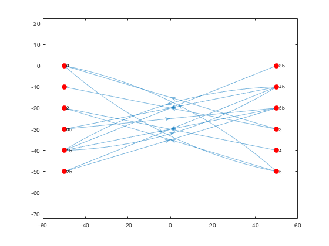
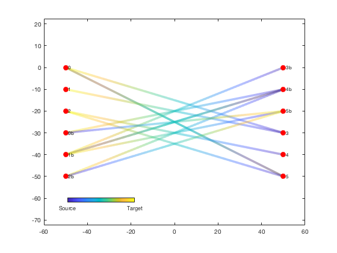
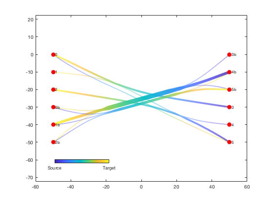

# Divided edge bundling for Matlab


Author: Kelly Kearney


This repository includes the code for the `debundle.m` and `plotdeb.m` Matlab functions, along with all dependent functions required to run them.


These two functions replicate the divided edge bundling algorithm, which provides an edge-routing method to declutter complex directional network graphs while highlighting major directional edge pathways.  The algorithm, which is an extention of force-directed edge bundling, was developed by David Selassie and is described in the following paper:


- Selassie D, Heller B, Heer J (2011) Divided edge bundling for directional network data. IEEE Trans Vis Comput Graph 17:2354-2363


Please note that I am not a coauthor on this paper; I simply coded this Matlab version so I could incorporate the divided edge bundling algorithm into my own research.  While I would appreciate acknowledgement if you happen to use this particular implementation of the algorithm, please be sure to cite Salassie's paper as the primary citation.


## Contents


- Getting started        
- Syntax        
- Example        
- Contributions

## Getting started


**Prerequisites**


This function requires Matlab R2015b or later.


**Downloading and installation**


This code can be downloaded from [Github](https://github.com/kakearney/divedgebundle-pkg/).


**Matlab Search Path**


The following folders need to be added to your Matlab Search path (via `addpath`, `pathtool`, etc.):


```matlab
divedgebundle-pkg/ConsoleProgressBar
divedgebundle-pkg/InterPointDistanceMatrix
divedgebundle-pkg/aggregate
divedgebundle-pkg/catuneven
divedgebundle-pkg/divedgebundle
divedgebundle-pkg/interparc
divedgebundle-pkg/minmax
divedgebundle-pkg/singlepatch
```


## Syntax


`Gnew = debundle(G)` calculates bundled edge pathways based on the exisiting digraph `G`.  The Node table in `G` must include Name, x, and y properties for each node, and the Edge table in `G` must include EndNodes and Weight for each edge.  The output digraph `Gnew` will be identical to `G` but with x, y, and BundleCompat properties added to the Edge table.


|Gnew = debundle(G, Name, Value, ...) adjusts the edge bundling calculation parameters.  See function help for a list of named parameters.


`plotdeb(Gnew)` plots the edges of an edge-bundled digraph as color-transitioning patches with widths corresponding to bundle weight.


`h = plotdeb(Gnew)` returns the handle of the plotted patch object.


## Example


This example will use the 3 x 3 example from the Selassie 2011 paper (used in Figures 7, 8, and 9 of the paper).  It consists of two columns of 6 nodes each, with edges crisscrossing in both directions.


We'll start with lists of node coordinates and names, as well as source and target node names for each edge:


```matlab
x   = [  -50  -50  -50   50   50   50  -50  -50  -50   50   50   50];
y   = [    0  -10  -20    0  -10  -20  -30  -40  -50  -30  -40  -50];
id  = {  '0'  '1'  '2' '3b' '4b' '5b' '0b' '1b' '2b'  '3'  '4'  '5'};

src = {  '0'  '3'  '3'  '5'  '5'  '4' '3b' '4b' '5b' '4b' '1b' '0b' '4b' '2b'};
tar = {  '5'  '0'  '1'  '2'  '0'  '2' '1b' '1b' '1b' '0b' '4b' '5b' '2b' '5b'};
```


We can then use this information to build a Matlab digraph object.


```matlab
G = digraph(src, tar, ones(size(tar)))
```


```

G = 

digraph with properties:

Edges: [14x2 table]
Nodes: [12x1 table]


```


A regular Matlab digraph object doesn't include coordinates for its nodes, but the divided edge bundling algorithm will need this.  We can add the coordinates as new table variables under the the Nodes property of the diagraph object:


```matlab
[~,loc] = ismember(G.Nodes.Name, id);
G.Nodes = [G.Nodes table(x(loc)', y(loc)', 'variablenames', {'x','y'})];

disp('G Nodes table:');
G.Nodes
disp('G Edges table:');
G.Edges
```


```
G Nodes table:

ans = 

Name     x      y 
____    ___    ___

'0'     -50      0
'5'      50    -50
'3'      50    -30
'1'     -50    -10
'2'     -50    -20
'4'      50    -40
'3b'     50      0
'1b'    -50    -40
'4b'     50    -10
'5b'     50    -20
'0b'    -50    -30
'2b'    -50    -50

G Edges table:

ans = 

EndNodes      Weight
____________    ______

'0'     '5'     1     
'5'     '0'     1     
'5'     '2'     1     
'3'     '0'     1     
'3'     '1'     1     
'4'     '2'     1     
'3b'    '1b'    1     
'1b'    '4b'    1     
'4b'    '1b'    1     
'4b'    '0b'    1     
'4b'    '2b'    1     
'5b'    '1b'    1     
'0b'    '5b'    1     
'2b'    '5b'    1     


```


Here's the resulting digraph, depicted using Matlab's built-in graph plotting function:


```matlab
h = plot(G, 'XData', G.Nodes.x, 'YData', G.Nodes.y, ...
'NodeColor', 'r', 'MarkerSize', 8);
axis equal;
```




Alternatively, we can plot the edges using `plotdeb` in initial mode, where the edges are just depicted as straight lines without any bundle weighting:


```matlab
he1 = plotdeb(G, 'initial', true);
set(h, 'EdgeColor', 'none');
uistack(h, 'top');

cb = colorbar('south');
set(cb, 'position', [0.2 0.2 0.2 0.02]);
set(cb, 'ticks', [0 1], 'ticklabels', {'Source', 'Target'});
```




We can now run the divided edge bundling algorithm.  The code runs pretty quickly for a small graph like this example, but it can take a while for the calculations to complete when used on large, complex graphs.  The progress bars printed to the Command Window show the progress as the code preprocesses each edge and then runs 5 passes of the bundling calculation.


```matlab
G = debundle(G);
```


```
Preprocessing...
100% [=================================================>]   14/  14
Elapsed time is 0.015872 seconds.
Bundling...
Pass 1
100% [=================================================>] Pass 1: 29 of 29
Elapsed time is 0.052424 seconds.
Pass 2
100% [=================================================>] Pass 2: 29 of 29
Elapsed time is 0.107576 seconds.
Pass 3
100% [=================================================>] Pass 3: 29 of 29
Elapsed time is 0.219979 seconds.
Pass 4
100% [=================================================>] Pass 4: 29 of 29
Elapsed time is 0.436848 seconds.
Pass 5
100% [=================================================>] Pass 5: 29 of 29
Elapsed time is 0.893494 seconds.
Postprocessing...
Done

```


We can plot the new bundled and weighted edges with the `plotdeb` function (and hide the old edges):


```matlab
delete(he1);
he2 = plotdeb(G, 'w', 5);
uistack(h, 'top');
```





## Contributions


Community contributions to this package are welcome!


To report bugs, please submit [an issue](https://github.com/kakearney/divedgebundle-pkg/issues) on GitHub and include:


- your operating system
- your version of Matlab and all relevant toolboxes (type `ver` at the Matlab command line to get this info)
- code/data to reproduce the error or buggy behavior, and the full text of any error messages received

Please also feel free to submit enhancement requests, or to send pull requests (via GitHub) for bug fixes or new features.


<sub>[Published with MATLAB R2016b]("http://www.mathworks.com/products/matlab/")</sub>
